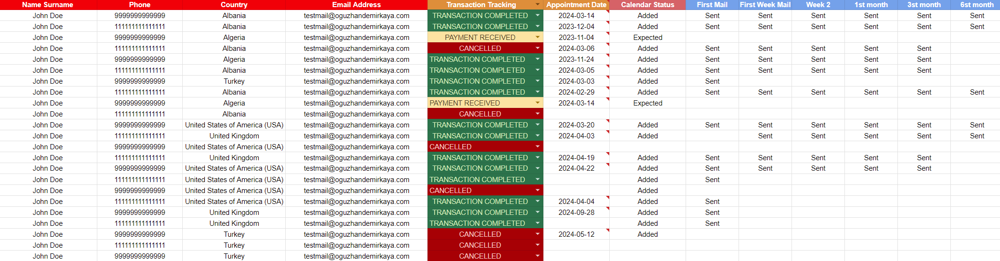

# Google Sheets to Calendar and Email Automation Script

This script automates the process of creating calendar events from form submissions stored in Google Sheets and sending email reminders based on specific time intervals. It is designed to work with Google Sheets, Google Calendar, and Gmail.

## Features

- **Event Creation**: Automatically creates Google Calendar events from data stored in a Google Sheet.
- **Email Notifications**: Sends an instant email notification when a calendar event is created and additional reminder emails based on set time intervals.
- **Customizable Reminders**: You can set email reminders for different intervals, such as 7 days, 14 days, 30 days, and more, and tailor the message accordingly.
- **Flexible Usage**: Suitable for use with any form submissions saved to Google Sheets (e.g., from a website form) or manually entered data.

## How It Works

1. The script reads the data from a Google Sheet (`Sayfa1`).
2. For each new entry in the sheet, a calendar event is created using the specified date.
3. Email notifications are sent upon event creation, and periodic reminders are scheduled based on the event date.
4. The script also checks daily for events that require a reminder and sends reminder emails accordingly.

## Installation

1. **Set Up Google Sheets and Calendar**: Create a Google Sheet with the necessary columns: `Event Title`, `Phone`, `Email`, `Country`, and `Event Date`.
2. **Google Apps Script**: Open the script editor in Google Sheets by navigating to `Extensions > Apps Script`.
3. **Copy the Script**: Copy and paste the provided script into the Google Apps Script editor.
4. **Calendar ID**: Replace `'CALENDARID'` in the script with your Google Calendar ID.

## Example Data Structure in Google Sheets

| Event Title | Phone    | E-mail           | Country | Date        | Event Added | Email Sent | First Week | Second Week | First Month | ... |
|-------------|----------|------------------|---------|-------------|-------------|------------|------------|--------------|------------ |-----|
| Event Name  | 123-4567 | example@email.com| USA    | 2024-10-12 | Added         | Sent       | Sent       |              |             |     |

## Usage

1. **Form Submissions**: When a new form submission is entered into the sheet, the script will automatically create a calendar event and send an email notification.
2. **Reminder Emails**: The script will send email reminders based on the time intervals you have set (7 days, 14 days, etc.).

## Notes

- Ensure that the GmailApp and CalendarApp services are enabled in your Google account for the script to work correctly.
- You can customize the time intervals and email messages by adjusting the arrays `timeDifferences`, `emailSubjects`, and `messages` in the `checkAndSendEmailsForDate` function.

